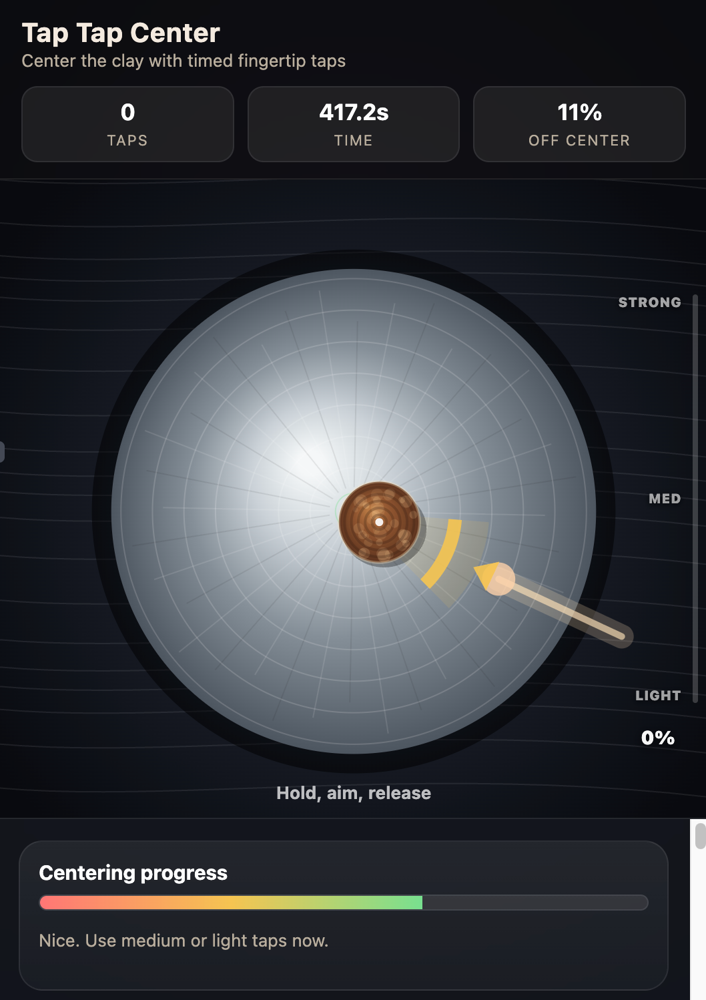

# Tap Tap Center

**Can you center the clay? Play it free, right in your browser — no install, no account.**

> **[Play Now →  kiichi.github.io/tap-tap-center](https://kiichi.github.io/tap-tap-center/)**

A potter's wheel skill game. The clay starts off-center on a spinning wheel. Your job: center it with perfectly timed, precisely powered fingertip taps. Fewer taps, faster time, and cleaner power earns a higher rank — up to **Living National Treasure 人間国宝**.

---

## Play it now

| Where | Link |
|---|---|
| Hosted (GitHub Pages) | [kiichi.github.io/tap-tap-center](https://kiichi.github.io/tap-tap-center/) |
| Original on voov.ai | [catalyst.voov.ai/share/gp5ccLYvDjG_bLY4FsrgX1](https://catalyst.voov.ai/share/gp5ccLYvDjG_bLY4FsrgX1) |

Works on desktop and mobile. No download. Tap to start.

---

## How to play

The **golden arc** on the lower-right of the wheel marks the sweet spot. Hold to charge power, then release when the clay is in that zone.

### Controls

| Action | Input |
|---|---|
| Charge a tap | Hold click / tap / Space |
| Release the tap | Let go |
| Restart | **Restart** button or `R` |

### Power

- Quick click = lightest touch
- Hold longer = more power (watch the vertical gauge)
- Too little: clay barely moves. Too much near center: overshoot.

### Tap feedback

| Label | Meaning |
|---|---|
| Perfect tap! | Great timing and power |
| Good tap | Solid improvement |
| Too light | Hold longer next time |
| Too strong! | Release sooner |
| Bad angle | Clay wasn't in the golden zone |
| Worse! | Pushed clay further off center |

Use the **RPM slider** to crank up difficulty — faster spin = tighter timing window.

---

## Ranks

| Rank | Japanese | Meaning |
|---|---|---|
| Deshi | 弟子 | Apprentice |
| Senpai | 先輩 | Senior |
| Sensei | 先生 | Master |
| Dai Sensei | 大先生 | Great Master |
| Ningen Kokuhou | 人間国宝 | Living National Treasure |

**Top rank tip:** Center in 3–4 taps with ~48% average power and clean timing.

---

## Feedback & sharing

Share your rank on Instagram: [@bentogram22](https://www.instagram.com/bentogram22)

---

## Credits

Built with [voov.ai](https://voov.ai) — an incredible platform for the next generation of the AI ecosystem.
